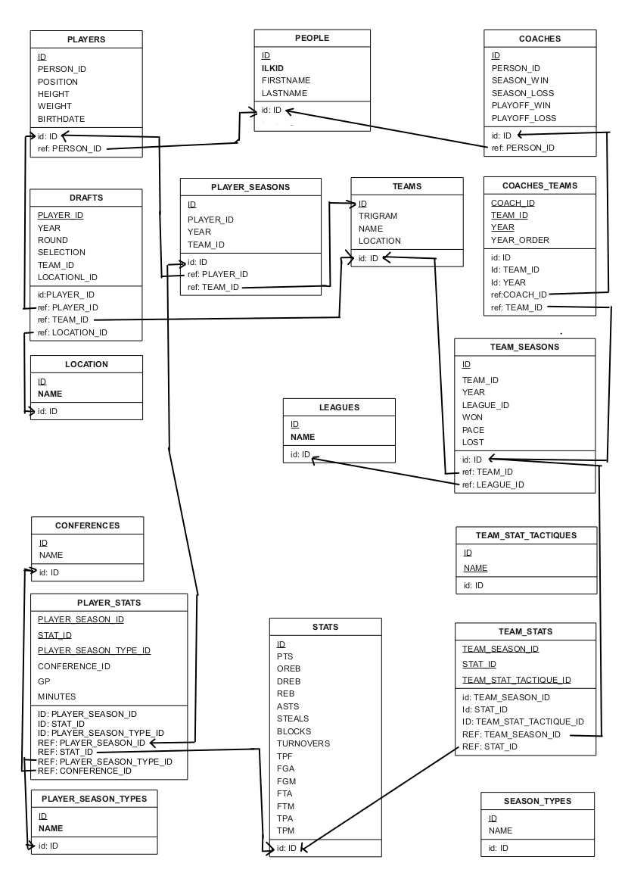

-------------
Deliverable 1
-------------

    *The goal of this deliverable is to design an ER model, a corresponding relational schema and create the database tables in the given database. The organization of the data in files and the given description does not imply neither an ER model nor a relational schema. It is given to help the student understand the format of the data faster. Finally, a discussion about constraints and removing redundant information is expected.*

Create the ER model for the data
================================

The Schema
----------

See the figure on next page.

   ER Schema made using Dia_.

.. _Dia: http://live.gnome.org/Dia

Decision made building the Entity-Relationship schema
-----------------------------------------------------

We tried to remove every denormalized fields, meaning fields that are representing information you can obtain using the rest of the data set.

People
''''''

* *Players* and *Coaches* are pointing to the same entities the coach's `coach_id` and the player's `ilkid` are defining the same thing (e.g. `MOEDO01`). So we grouped them under the *Person* entity.

* *Player*'s height will be converted into inches, `1ft = 12in`.

* *Player*'s fields like `first_season`, `last_season` or `college` can be obtained from the *Draft* and *Player Season* entities. They are just denormalized fields.

Teams
'''''

The teams pretty look like the CSV file, except that we removed the league from it since some teams switched from *ABA* to *NBA* when *ABA* merged into the later.

Conference and leagues
''''''''''''''''''''''

According to Wikipedia_, a team belongs to a *Division* which belongs to a *Conference* (being *Eastern* and *Western*). We first linked the team to a *Conference* but the dataset gives the information about the *Conference* only on *All Star* games (where the best players of each *Conferences* create an *All Star* team and play against each other). So, the *Conference* information will only live there because of the dataset.

About *Leagues*, there are two of them *ABA* and *NBA* and a team may have changed during the year 1975 when *ABA* got merged into the *NBA*.

.. _Wikipedia: http://en.wikipedia.org/

Drafts and Location
'''''''''''''''''''

One major change from the dataset here is that the *People* who go drafted but never played will exist has a *Player*. Those kind of *Player* never played.

*Location* isn't really important, it's been moved out for further queries.

**NB** it doesn't have any link with the *Team*'s location which is a city when here, it's the College where the *Player* got drafted from.

**Q:**
   *Shouldn't we link Drafts to People and not Players in that case?*

**A:**
   No because even players who have never played for an ABA or NBA team have played before for a European team or a school team. Therefore they already have the characteristics of player (position, height, weight, birthdate) when they are drafted.

Stats and Seasons
'''''''''''''''''

The *Stats* (statistics) being very standard, it'll live as itself and being kind of *casted* into a *Player* or *Team* stat depending on the case. A *Stat* is all the time linked to a *Season* which is identified by the starting year in the dataset and our model (e.g. `1984` means `the season 84-85`).

Each *Player* and *Team* has a specific *Season* entity linked to it for each *year* played.

Then *Teams* have *offensive* and *defensive* statistics while the *Players* have statistics per kind of *Seasons* played:

* Regular
* Playoff
* and All Stars

**NB:** All the career stats were seen as denormalized and thus removed. We can get those data back from the yearly *Stats*.

Design the database and the constraints needed to maintain the database consistent
==================================================================================

See the figure on next page.

Create the SQL commands to create the tables in Oracle
======================================================

The following SQL schema is really a first shot, with very few constraints on numbers and strings (`varchar`).

Not being familiar with the way Oracle works, we'll just explain some basic stuff.

Oracle specificities
--------------------

Oracle being a very complex RDBMS (*Relational Database Management System*) that we are still learning, this section will simply clarify what we've discovered and wich might explain the following.

It cannot *auto increment* like MySQL or SQLite, so one must use a `sequence` and use it to get the current value or the next value when insert new rows.

.. literalinclude:: _static/1/data.sql
   :language: sql
   :lines: 1

It knows how to delete relations in cascade. It can remove an entire structure from one simple `DELETE`. If *PostgreSQL* can do that has well, the more common *MySQL* or *SQLite* cannot. In the following schema, we activated that cascaded deletion without thinking deeply about it. This schema will be refined in the future when used with the data.

SQL code
--------

.. literalinclude:: _static/1/schema.sql
   :language: sql

.. TODO: discussion on the constraints 

Conclusion
==========

As we decided to go with `Ruby on Rails`_, we expect future changes to be mainly imposed by any limitations that ActiveRecord_ has.

.. _Ruby on Rails: http://rubyonrails.org/
.. _ActiveRecord: http://ar.rubyonrails.org/
