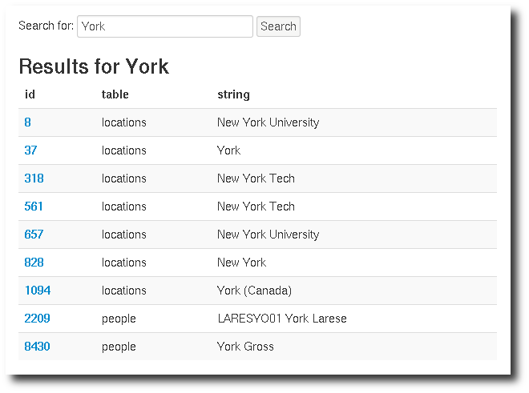
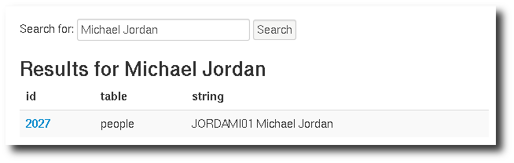

-------------
Deliverable 2
-------------

    *The students should accommodate the situation where new data is inserted in any table. Moreover, a simple query which can search for a keyword in any table should be implemented. The user should be able to see more details of the result of the query (e.g., if someone searches for Michael Jordan's regular season statistics and the result has multiple seasons, he/she should be able to see statistics for individual seasons - for example, through a hyperlink).*

Post deliverable 1
==================

**TODO: write some BS about how we changed stuff regarding the remarks made by the TAs.**

Changes in the schema
---------------------

**TODO: explain the changes made in the SQL schema relative to design mistakes and ROR requirements**

Import the data from the given CSV files into the created database
==================================================================

As mentioned before, we are using *Ruby on Rails* as the application framework in order to build the final application. Below is the very few step required to set it up correctly, as we did it for our local machines. The database configuration is found into the `config/database.yml` file into the *Rails* application (called `nba`). It's set up to be the same credentials for the local and remote (@EPFL) database for simplicity.

Setting up the schema
---------------------

The following commands will execute the schema creation and loads some initial data (like *leagues*, *conferences*, and so on). ::

    $ sqlplus DB2012_G06/DB2012_G06@XE < document/sql/schema.sql
    $ sqlplus DB2012_G06/DB2012_G06@XE < document/sql/data.sql

Setting up the Rails application
--------------------------------

The application dependencies are listed in the `Gemfile` and you should use `bundler` to handle it. It's as easy as the following. ::

    $ sudo gem install rails bundler
    $ cd nba
    $ bundle install

Importing the data
------------------

The next commands are creating some extra tables (required by the admin interface) and starts parsing the CSV files (from the `dataset` directory). We didn't touch the initial file and applied all the workarounds into the import script directly. ::

    $ cd nba
    $ rake db:migrate
    $ rake import:all

Accommodate the import of new data in the database they created in the 1st deliverable
======================================================================================

To us, this point is about having an admin interface. We've chosen ActiveAdmin_ which enable easy and nifty automagic interface in respect of the defined model (ActiveRecord_).

.. _ActiveAdmin: http://activeadmin.info/
.. _ActiveRecord: http://ar.rubyonrails.org/

That's enough for adding simple data. To bulk import more CSV, the import script will just do it by replacing the existing CSV files and running the `import:all` command or any of the per CSV file ones, like: `import:teams`. **NB:** we are assuming it would work but weren't able to test this. You've been warned.

Screenshots
-----------

Find below some screenshots of the basic CRUD it enables.

**TODO: screenshots**

Implement the simple search queries 
===================================

The SQL command is right below. Without any external fulltext search engine, we have to perform a `LIKE '%term%'` on any candidates fields of each tables we would like to be searchable. As it's basically *n* queries, we join them together with the table name to be able to figure out where does it come from.

.. literalinclude:: ../../../queries/search.sql
   :language: sql
   :lines: 3-

Screenshots
-----------

Find below some screenshot of the search in action. The webpage shows the SQL command ran as well.

   Searching for *York* among multiple different tables.

Below an example of searching a value made from multiple fields. It's very basic but doing better really requires a better strategy than `LIKE`. They are tons of brilliant softwares that does that very well (Lucene, Solr, Sphinx, Xapian, …).

   Searching for *Michael Jordan* with show how combined words can be search. It would not work for *Jordan Micheal* though.

Implement the follow-up search queries of the result of the initial search
--------------------------------------------------------------------------

The result of the initial search may look like this.

+------------+-------+-----------------------+
| table name | id    | string                |
+============+=======+=======================+
| people     | 4050  | JAMESMA01 Max Jameson |
+------------+-------+-----------------------+
| teams      | 20    | CHI Bulls             |
+------------+-------+-----------------------+
| …          | …     | …                     |
+------------+-------+-----------------------+

From there, we can display something directly and add a link to the proper view for each line.

Implement using SQL the following queries
=========================================

A view as been built for each query, which makes them easier to be ran from the web application.

Query A
-------

    *Print the last and first name of players/coaches who participated in NBA both as a player and as a coach.*

The *League* information is tied to a *Team* since each team belongs to a *League*. A *Coach* is linked to a *Team* via the *Coaches Team* table which express a season as coach for the given *Team*. A season played for a *Team* by a *Player* is expressed using the *Player Season* relation. This query fetches all the *Coaches* and all the *Players* from the given *League* and see the ones who match the same *Person*.

.. literalinclude:: ../../../queries/basic_a.sql
   :language: sql
   :lines: 3-

Query B
-------

    *Print the last and first name of those who participated in NBA as both a player and a coach in the same season.*

This is is very similar to the *Query A* above with one more restriction. The *Coaches Team* and the *Player Season* have to match the same *year* as well.

.. literalinclude:: ../../../queries/basic_b.sql
   :language: sql
   :lines: 3-

Query C
-------

    *Print the name of the school with the highest number of players sent to the NBA.*

In order to get the school (or country for foreign players) information, we have to compute among all the drafts which `location` comes first. For people unfamiliar with *Oracle* (like us), you cannot do a simple `GROUP BY locations LIMIT 1` as `LIMIT` doesn't exist in this RDBMS. The alternative is to compute the `RANK()`. The great advantage of RANK_ is that it may return more than one results in case of equality.

.. _RANK: http://www.adp-gmbh.ch/ora/sql/analytical/rank.html

.. literalinclude:: ../../../queries/basic_c.sql
   :language: sql
   :lines: 3-

Query D
-------

    *Print the names of coaches who participated in both leagues (NBA and ABA).*

What we are llooking for is simply the intersection of coaches who participated in NBA with
coaches who participated in the ABA. In order to facilitate things, we create two views:
`nba_coaches` and `aba_coaches`, and use the Oracle/SQL INTERSECTION operator between those
views.

The `xxx_coaches` views are just simple JOINs with a condition on the league name. Note that
with a different JOIN order, we used to have 0 results. With this order, we have 45 results.

.. literalinclude:: ../../../queries/basic_d.sql
   :language: sql
   :lines: 3-

Query E
-------

    *Compute the highest scoring and lowest scoring player for each season.*

By ranking over the number of points a player has gotten, we can easily compute the highest
scoring player of all times, by simply ordering by descending rank and querying the one with the rank 1.

Since we want the best and worst player for *each* season, we have to use `PARTITION BY year`, which
allows us to rank players for each year. Thus, we create two views, one with the best players by year,
and one with the worst players. Those views are named `best_players` and `worst_players` respectively.

The next problem is that, for some seasons, there are ex aequos: there might be two or three players that
are the best of a season. Similary for worst players, which happens even more often since scoring 0 points
is apparently a common occurence. To cunter that, we create views based on `best_players` and `worst_players`
but with unique years, taking only the last row for every given year.

With all that done, we're just left with combining the `best_players_unique` and `worst_players_unique`
views, simply joining them on year.

.. literalinclude:: ../../../queries/basic_e.sql
   :language: sql
   :lines: 3-

Query F
-------

    *Print the names of oldest and youngest player that have participated in the playoffs for each season.*

**TODO: explain how it works**

.. literalinclude:: ../../../queries/basic_f.sql
   :language: sql
   :lines: 4-

Build an interface to access and visualize the data
===================================================

Run the next command to start the webserver. ::

    $ cd nba
    $ # the local database
    $ rails server
    $ # the remote database at the EPFL
    $ rails server -e production

**TODO: fill the following bullet points with amazing screenshots**

 * View of a team
 * View of a person (coach, player)
