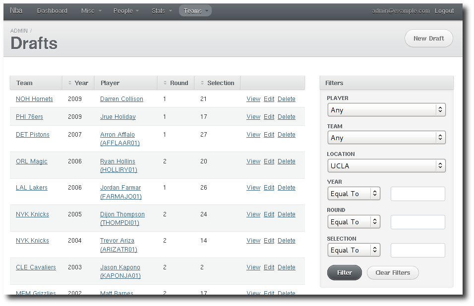
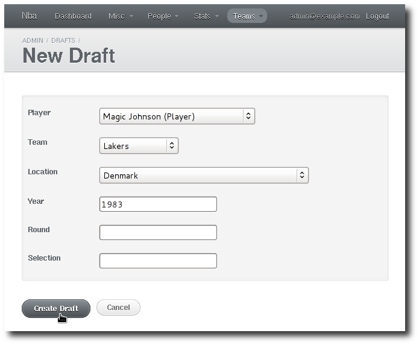

-------------
Deliverable 2
-------------

    *The students should accommodate the situation where new data is inserted in any table. Moreover, a simple query which can search for a keyword in any table should be implemented. The user should be able to see more details of the result of the query (e.g., if someone searches for Michael Jordan's regular season statistics and the result has multiple seasons, he/she should be able to see statistics for individual seasons - for example, through a hyperlink).*

Post-mortem deliverable 1
=========================

Some of the feedback we had.

    *In general, normalizing data is a good thing, but keep in mind that rebuilding some of the information that you discarded might be expensive. Do not hesitate to work with denormalized data if that will make your life easier. That will also help you to have a smaller ER model.*

    *On the other hand, working on normalization gave you some great insights on the data. You did a really nice job at studying the domain (i.e., NBA) and exploit such knowledge to fine tune your DB design!*

For the deliverable 2, we didn't had to start denormalizing again but were forced to move data around and denormalizing more in order to gain a better understanding of the dataset. Denormalization adds constraint on data integrity upon changes and we don't what to have to deal with that right now.

But we expect to be forced to start denormalizing fields for the upcoming tasks as things get more complex and intense.

    *[…] you did not explain why certain key constraints led to the translation in tables that you will use*

We read your feedbacks on schemas, *ISA* and key constraints but didn't took the time to go back to the design phase. *Getting real* and *hitting walls* mode.

    *Keep up the good work!*

Maybe the only thing we read after all.

Changes in the schema
---------------------

We made a lot of changes!

`NUMBER` aren't `INT`
'''''''''''''''''''''

The `NUMBER` datatype stores floating numbers. All the `NUMBER` got changed to promper `INT` except for the ones storing real numbers (i.e. `pace`).

`ID` everywhere
'''''''''''''''

As mentioned in the conclusion of deliverable 1, we expected some changes regarding limitations imposed by the software we are using, ActiveRecord_. The first change has been to set up `id` everywhere. The *active record pattern* has trouble working with composed primary keys which is common for tables expressing a *many-to-many* relationship.

.. _ActiveRecord: http://ar.rubyonrails.org/

.. literalinclude:: _static/1/schema.sql
   :language: sql
   :lines: 214-223

The composite primary key is converted into a unique constraint.

.. literalinclude:: _static/2/schema.sql
   :language: sql
   :lines: 218-234

You can notice that other elements of this table changed. They are explained below.

    *Sidenote:* when using *InnoDB* with MySQL, it's recommended to always have an id because the engine will store the entry on the disk based on that. Specifying it ensure that newest entries are all close to each other. See: http://backchannel.org/blog/friendfeed-schemaless-mysql

Creating `player_allstars`
''''''''''''''''''''''''''

We initially thought we could aggregate all the `Stat` of one player into a generic table, for the three season types: *Regular*, *Playoff* and *Allstar*. While doing the import, we realized that the later is too different from the others. *Allstar* is **not** linked wia *Team* and thus cannot be tied to a *Player Season* like the two others.

.. literalinclude:: _static/2/schema.sql
   :language: sql
   :lines: 292-309

You can notice the same *pattern* describe above with `id` and the unique constraint.

Fixing the `Coaches`
''''''''''''''''''''

First, we renamed *Coaches Team* to *Coach Season* which makes much more sense.

Secondly, a mistake was made to store. the `season_win`, `season_loss`, … into the *Coach* itself. This data is the denormalized one and must be into the *Coach Season* instead.

That made us realizing that we had some data duplication. *Team Season* were storing `won`, `pace` and `lost`. `win` and `lost` can be computed using the *Coach Season* and thus got removed from *Team Season*.

.. literalinclude:: _static/2/schema.sql
   :language: sql
   :lines: 43-49,100-118

Moving the `League` where it belongs and dropping `TeamSeason`
''''''''''''''''''''''''''''''''''''''''''''''''''''''''''''''

We identified *Team* by its *trigram* (those three-letters) after some trouble during the implementation of the import script. The website where our data are coming from (http://http://www.databasebasketball.com/) helped us understanding that it's—in fact—the league identifies the team as well. Knowing that, we moved the *League* from *Team Season* back into *Team* and as the *Team Season* was only containing the information about the *year*, it got moved into the *Team Stat* as well as `pace` which is displayed on the *Offensive* stat on the mother website.

It was also flawed since—to retrieve the league for *Draft*—we had to guess the *Team Season* based on the *Team* and *year* information. And no guarantees are made that that season has (already) been played.

To summarize this change:

* `Team` know which league it belongs to;
* `TeamStats` are referencing a `Team` and contains the information about `year` and `pace`.
* `TeamSeason` is no more.

.. literalinclude:: _static/2/schema.sql
   :language: sql
   :lines: 85-95,216-233

Import the data from the given CSV files into the created database
==================================================================

As mentioned before, we are using *Ruby on Rails* as the application framework in order to build the final application. Below is the very few step required to set it up correctly, as we did it for our local machines. The database configuration is found into the `config/database.yml` file into the *Rails* application (called `nba`). It's set up to be the same credentials for the local and remote (@EPFL) database for simplicity.

Setting up the schema
---------------------

The following commands will execute the schema creation and loads some initial data (like *leagues*, *conferences*, and so on). ::

    $ sqlplus DB2012_G06/DB2012_G06@XE < document/sql/schema.sql
    $ sqlplus DB2012_G06/DB2012_G06@XE < document/sql/data.sql

Setting up the Rails application
--------------------------------

The application dependencies are listed in the `Gemfile` and you should use `bundler` to handle it. It's as easy as the following. ::

    $ sudo gem install rails bundler
    $ cd nba
    $ bundle install

Importing the data
------------------

The next commands are creating some extra tables (required by the admin interface) and starts parsing the CSV files (from the `dataset` directory). We didn't touch the initial file and applied all the workarounds into the import script directly. ::

    $ cd nba
    $ # locally
    $ rake db:migrate
    $ rake import:all
    $ # remotely
    $ RAILS_ENV=production rake db:migrate
    $ RAILS_ENV=production rake import:all

**NB:** A faster way of loading data would be to transform the CSV into ready-to-be-inserted CSV and bulk loading them. As we don't trust that much the input data, we went for the much more sluggish approach that performs individual inserts. In the end, it's way easier to debug and it teaches Zen.

Accommodate the import of new data in the database they created in the 1st deliverable
======================================================================================

To us, this point is about having an admin interface. We've chosen ActiveAdmin_ which enable easy and nifty automagic interface in respect of the defined model (ActiveRecord_).

.. _ActiveAdmin: http://activeadmin.info/
.. _ActiveRecord: http://ar.rubyonrails.org/

That's enough for adding simple data. To bulk import more CSV, the import script will just do it by replacing the existing CSV files and running the `import:all` command or any of the per CSV file ones, like: `import:teams`. **NB:** we are assuming it would work but weren't able to test this. You've been warned.

Screenshots
-----------

Find below some screenshots of the basic CRUD it enables.

   Listing all the drafts to NBA made by UCLA.

   Creating a new draft for Magic Johnson.

Implement the simple search queries
===================================

The SQL command is right below. Without any external fulltext search engine, we have to perform a `LIKE '%term%'` on any candidates fields of each tables we would like to be searchable. As it's basically *n* queries, we join them together with the table name to be able to figure out where does it come from.

.. literalinclude:: ../../../queries/search.sql
   :language: sql
   :lines: 3-

Screenshots
-----------

Find below some screenshot of the search in action. The webpage shows the SQL command ran as well.

Below an example of searching a value made from multiple fields. It's very basic but doing better really requires a better strategy than `LIKE`. They are tons of brilliant softwares that does that very well (Lucene, Solr, Sphinx, Xapian, …).

Implement the follow-up search queries of the result of the initial search
--------------------------------------------------------------------------

The result of the initial search may look like this.

+------------+-------+-----------------------+
| table name | id    | string                |
+============+=======+=======================+
| people     | 4050  | JAMESMA01 Max Jameson |
+------------+-------+-----------------------+
| teams      | 20    | CHI Bulls             |
+------------+-------+-----------------------+
| …          | …     | …                     |
+------------+-------+-----------------------+

From there, we can display something directly and add a link to the proper view for each line.

Implement using SQL the following queries
=========================================

A view as been built for each query, which makes them easier to be ran from the web application.

Query A
-------

    *Print the last and first name of players/coaches who participated in NBA both as a player and as a coach.*

The *League* information is tied to a *Team* since each team belongs to a *League*. A *Coach* is linked to a *Team* via the *Coaches Team* table which express a season as coach for the given *Team*. A season played for a *Team* by a *Player* is expressed using the *Player Season* relation. This query fetches all the *Coaches* and all the *Players* from the given *League* and see the ones who match the same *Person*.

.. literalinclude:: ../../../queries/basic_a.sql
   :language: sql
   :lines: 3-

Query B
-------

    *Print the last and first name of those who participated in NBA as both a player and a coach in the same season.*

This is is very similar to the *Query A* above with one more restriction. The *Coaches Team* and the *Player Season* have to match the same *year* as well.

.. literalinclude:: ../../../queries/basic_b.sql
   :language: sql
   :lines: 3-

Query C
-------

    *Print the name of the school with the highest number of players sent to the NBA.*

In order to get the school (or country for foreign players) information, we have to compute among all the drafts which `location` comes first. For people unfamiliar with *Oracle* (like us), you cannot do a simple `GROUP BY locations LIMIT 1` as `LIMIT` doesn't exist in this RDBMS. The alternative is to compute the `RANK()`. The great advantage of RANK_ is that it may return more than one results in case of equality.

.. _`RANK`: http://www.adp-gmbh.ch/ora/sql/analytical/rank.html

.. literalinclude:: ../../../queries/basic_c.sql
   :language: sql
   :lines: 3-

Query D
-------

    *Print the names of coaches who participated in both leagues (NBA and ABA).*

What we are looking for is simply the intersection of coaches who participated in *NBA* with coaches who participated in the *ABA*. In order to facilitate things, we create two views: `nba_coaches` and `aba_coaches`, and use the INTERSECT_ operator between those views.

.. _`INTERSECT`: https://en.wikipedia.org/wiki/Union_%28SQL%29#INTERSECT_operator

The `[an]ba_coaches` views are just simple `JOIN` with a condition on the league name. **NB:** with a different `JOIN` order, it gives no results. With the same order, we have 45 results.

.. literalinclude:: ../../../queries/basic_d.sql
   :language: sql
   :lines: 3-

Query E
-------

    *Compute the highest scoring and lowest scoring player for each season.*

By ranking over the number of points a player has gotten, we can easily compute the highest scoring player of all times, by simply ordering by descending rank and querying the one with the first rank.

Since we want the best and worst player for *each* season, we have to use `PARTITION BY year`, which allows us to rank players for each year. Thus, we create two views, one with the best players by year, and one with the worst players. Those views are named `best_players` and `worst_players` respectively.

The next problem is that, for some seasons, there are ex aequos: there might be two or three players that are the best of a season. Similary for worst players, which happens even more often since scoring 0 points is apparently a common occurence. To counter that, we create views based on `best_players` and `worst_players` but with unique years, taking only the last row for every given year.

With all that done, we're just left with combining the `best_players_unique` and `worst_players_unique` views, simply joining them on the year.

.. literalinclude:: ../../../queries/basic_e.sql
   :language: sql
   :lines: 3-

Screenshot
''''''''''

Sample output of how it's displayed in the interface.

Query F
-------

    *Print the names of oldest and youngest player that have participated in the playoffs for each season.*

This query works exactly like *Query E*, except that instead of `best_players` and `worst_players` we have `youngest_players` and `oldest_players`. The ranking works exactly the same, only ordered by birthdate instead of season points. We also need to weed out duplicates, and to add a test on season types to only get players who participated in the playoffs. Similarly, `youngest_players_unique` and `oldest_players_unique` are joined on year.

.. literalinclude:: ../../../queries/basic_f.sql
   :language: sql
   :lines: 4-

Build an interface to access and visualize the data
===================================================

Run the next command to start the webserver. ::

    $ cd nba
    $ # the local database
    $ rails server
    $ # the remote database at the EPFL
    $ rails server -e production

Screenshots
-----------

Find below some screenshots of the view that exists outside the admin interface. **NB:** they may not reflect the final code.

People
''''''

.. image:: _static/2/person_coach.png
   :scale: 75%

Teams
'''''

Conclusion
==========

We hit the wall pretty hard by getting to know a little better the data while importing it. Guessing out the data really is by reading some CSV is very poor. We guess it's what people call the *implementation gap*. It was way bigger than we usually thought. Knowing that, we can predict that more changes will occur has we progress further.

Working with *Ruby on Rails* and *Oracle XE* is a pretty hard setup to get. But once it works, it's a real bliss (if you have tons of spare RAM). *ActiveAdmin* offers very quickly a way to browse the imported data, spotting mistakes and *ActiveRecord* makes any relationships querying easy.

*Oracle* is still pretty new to us and the proposed solution are obtained more using the trial and error method than a one shot query that works directly. Stuff like `RANK`, `PARTITION` are uncommon when you have some insight of alternative RDBMS like MySQL, PostgreSQL or SQLite.
