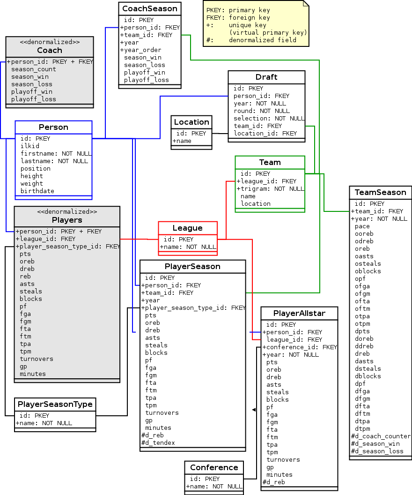
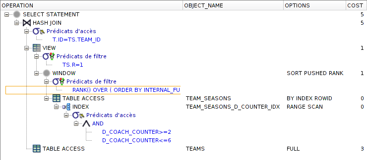

-------------
Deliverable 3
-------------

    *A series of more interesting queries should be implemented with SQL and/or using the preferred application programming language:*

    * *Explain the necessities of indexes based on the queries and the query plans that you can find from the system;*
    * *Report the performance of all queries and explain the distribution of the cost (based again on the plans;*
    * *Visualize the results of the queries (in case they are not scalar);*
    * *Build an interface to run queries/insert data/delete data giving as parameters the details of the queries.*

**TODO**

Post-mortem deliverable 2
=========================

    *Good job with the queries. Is there a reason why all queries are expressed as views? Please include the explanation for this decision in the report.*

It seemed easier for us to reuse them automagically from the web UI, but we were mistaken and the final code doesn't do that anymore. Both the SQL queries and the web application were simplified following that change.

    *Can you explain the remark about “different join order not giving any results” in query D? Please include this explanation in the final version of the report. Keep in mind that you're not getting the correct result (should be indeed 0 rows).*

**TODO: Amos**

    *Keep up the good work! (at least you're gonna read this...)*

Indeed!

Changes to the schema
---------------------

Many simplifications were made mostly for the sake of *keeping it stupid simple* but also because we gained knowledge of the data as we started used them more.

At the end of this section, you'll find the updated schema both picture (UML-like diagram) and SQL commands (without the denormalized stuff that will be describe after that).

The `Coach` is dead, long live the `Coach`
''''''''''''''''''''''''''''''''''''''''''

The `Coach` entity was in the end an empty shell pointing to a `Person`. So we dropped it. As you'll see below, it came back as a denormalization entity.

Same fate for the `Player`
''''''''''''''''''''''''''

After dropping the `Coach` it made sense to also drop the `Player`. Its data got merged into the `Person` entity. Not every `Player` had their ``birthdate`` or ``height`` and ``weight`` information and it could also be useful in the `Coach` use case (besides the ``position`` attribute).

Again, `Player` came back to contain denormalized data of the player's career stats.

Overkill `Stat`
'''''''''''''''

Everything under the `Stat` umbrella has been moved into their more specific entities: `PlayerStat`, `PlayerAllstart` and `TeamStat`. Even if they have many similarities it doesn't make sense to add that much complexity for so little improvement.

I would blame the *Object-Oriented Programming* kind of design we are practicing for years and corrupted our young minds. It doesn't really apply to this use case.

    *“Object-oriented design is the roman numerals of computing.”*
    — `Rob Pike`_

.. _Rob Pike: https://en.wikiquote.org/wiki/Rob_Pike

`TeamSeason` is the new `TeamStat`
''''''''''''''''''''''''''''''''''

The team statistics for each year were separated between *Defensive* and *Offensive* stats (badly called the *tactique*) creating two rows for a year. It doesn't make much sense and can only lead to further integrity problems if insertion or deletion fail at keeping a couple for a given year.

The new table is now very close to the original CSV file.

Missing informations
''''''''''''''''''''

The `League` was missing from the All Stars seasons (`PlayerAllstar`).

Adding the indices
''''''''''''''''''

SQL ``INDEX`` were created on the following columns:

* ``year`` everywhere it is used since it's acting as a *foreign key* identifying seasons without the burden of maintaining such an entity.
* `Person`'s ``ilkid``, ``firstname`` and ``lastname`` which is very useful during bulk insertion of new players. The current queries don't take advantages of those.

Were we did not create any indices:

* the small tables with very few items like `Conference`, `League` or `PlayerSeasonType` because:

 * the query could be optimized to use the `id` instead of the literal name;
 * those tables contain very few elements (here it's 2).

More explainations may be found on the details of the queries below.

Final schema
''''''''''''

.. literalinclude:: ../../sql/schema.sql
   :language: sql
   :lines: 4-291

Changes to the queries
----------------------

Since the schema changed, we had to change the previously done queries. The report for part 2 will still reflect the state at that point of time although the queries might not be exactly the same.

Queries **A** and **B** have trivial changes regarding the deletion of `Coach` and `Player`, one less join has to be done simplying the final query.

Queries **E** and **F** are also doing less ``JOIN`` since `Player` are no more (its data has being moved into `Person`) and everything that were into `Stat` is now into `PlayerStat`.

Query C
''''''''

This one changed a lot since the definition of how the `Draft` are counted got clearer. It also uses the powerful ``PARTITION`` method to cut some overkill sub-``SELECT``. Only the last `Draft` into a specified league `League` is kept and thus counts.

.. literalinclude:: ../../../queries/basic_c.sql
   :language: sql
   :lines: 4-

Query D
''''''''

**TODO: Amos**

.. literalinclude:: ../../../queries/basic_d.sql
   :language: sql
   :lines: 4-

Importing data
--------------

    *As per your comment, the logic in `import.rake` is quite hardcore. I'm not questioning at all your choice—as a matter of fact, in the same scenario I tend to attack the problem in the very same way (especially because the code plays the role of implicit documentation for each data transformation). Still, for the sake of completeness, I've to mention two other options:*

    * *manipulating the .csv with Excel/LibreOffice Calc is a viable and usually quicker solution (but worse in terms of maintainability).*
    * *instead of importing directly into the tables of your final DB schema, you could create a temporary table for each .csv file (same schema, no constraints) and ALTER them progressively. This usually leads to less LOC (being SQL more expressive than Ruby).*

This part was totally redone almost from scratch using ``sqlldr``, ``LOAD DATA`` and ``INSERT ALL INTO … SELECT FROM``. It reduced the importing time from more than one hour to around 2 minutes, a 30x improvement. Time improvement was the main goal here to give us more flexibility in playing with changes in the schema. Manipulating the CSV (more than changing the line ending) wasn't an option as it would make things harder to maintain.

A new method has been added ``import:schema`` which runs the three SQL files containing the commands about dropping the tables, sequences and procedures (``drop.sql``), creating the tables, sequences and procedures (``schema.sql``) and also importing some initial data (``data.sql``) like leagues, conferences and such.

Loading data with ``SQLLDR`` 101
''''''''''''''''''''''''''''''''

How it works for any CSV file:

* First, a table is created for the CSV file with all fields as ``VARCHAR2(255)`` as the CSV contains text.
* Then a *control.txt* file is created containing the SQL code to load the data. Check the code below. That code says that the fields are separated using the comma (``,``) and will convert any string ``'NULL'`` into the proper SQL ``NULL`` value:

.. literalinclude:: ../../../nba/lib/tasks/import.rake
   :language: ruby
   :lines: 391-407 

* Next step is the ``sqlldr`` call, which is a call to the executable with some arguments like the ``control.txt`` file, the ``userid`` being the connection string and ``skip`` which is set to 1 telling it to ignore the first line containing the column headings.
* Then the ``control.txt`` file is deleted.
* At this point, data is inserted into the *real* tables using a simple ``INSERT INTO`` (``#{tmp}`` is replaced by the _temporary_ table name):

.. literalinclude:: ../../../nba/lib/tasks/import.rake
   :language: sql
   :lines: 329-334

* Finally the initially created table is deleted. ``TEMPORARY TABLE``'s don't seem to work with that use case.

We won't clutter this part with more code here and invite you to take a look at ``nba/lib/tasks/import.rake`` for more details.

Denormalization
---------------

In the phase 1 and 2, we managed to get rid of every duplications, trying to keep the core data considering only consistency of the data stored.

We also knew that for some complex tasks, it'd become much more easier to have precomputed fields, tables. Find below which stuff were *denormalized*, how and why.

We tried to use `Materialized View`_ but they are unfortunately not available on Oracle XE. So we used only the more conventional ``TRIGGER``. Their usage might not be always adequate since its our first time. Any feedbacks will be appreciated.

.. _Materialized View: http://en.wikipedia.org/wiki/Materialized_view

`Coach`
'''''''

As mentioned before the `Coach` entity was an empty shell and not carrying any data. For the need of some queries and to reflect the CSV file ``coach_career.csv`` the `Coach` entry as been recreated and contains only denormalized data computed from the `CoachSeason` entities.

It could also become a way to know if a `Person` has acted as coach in his career.

.. literalinclude:: ../../sql/schema.sql
   :language: sql
   :lines: 325-385

`Player`
''''''''

Again, the `Player` entity was merged into a `Person` to better come back. It's new purpose is to reflect the CSV files ``player_career.csv`` and ``player_playoffs_career.csv`` keeping the denormalized sums of all the `PlayerStat` for each type of `PlayerSeason`.

The ``TRIGGER``'s are a bit trickier than before mostly because there is much more data involved.

.. literalinclude:: ../../sql/schema.sql
   :language: sql
   :lines: 387-535

Rebounds and ``TENDEX``
'''''''''''''''''''''''

For `PlayerStat` and `PlayerAllstar` (but **not** `TeamSeason`), the ``reb`` (rebounds), value is the sum of ``oreb`` and ``dreb``, so we were able to remove it which will enforce more integrity. Unfortunately the `TeamSeason` dataset contains data where that condition is not respected because ``oreb`` and ``dreb`` are empty.

Since the ``TENDEX`` value is easily computable for every `PlayerStat` entry a very simple trigger can keep that value up-to-date which will simplify much redundancy among the following queries (and prevent mistakes as well).

`PlayerStat` will get on extra column called ``d_tendex`` (``d_`` for denormalized) and an attached trigger called upon insertion or update. That value will remain ``NULL`` if the player never played, which makes sense.

.. literalinclude:: ../../sql/schema.sql
   :language: sql
   :lines: 295-323

`TeamSeason` and `CoachSeason`
''''''''''''''''''''''''''''''

Like the `Coach`, we'd like to keep some information within the `TeamSeason` coming from `CoachSeason`. This information is:

* How many coach seasons do we have;
* How many matches has been won during the regular season;
* How many matches has been lost during the regular season.

No data about the playoffs has been intergrated since `TeamSeason` doesn't reflect any data regarding the playoffs.

This denormalization was initiated by the Query S.

.. literalinclude:: ../../sql/schema.sql
   :language: sql
   :lines: 537-

The queries
===========

The ``EXPLAIN PLAN`` has been computing using *Oracle SQLDeveloper* and the following SQL command:

.. literalinclude:: ../../../queries/explain-query.pl
   :language: perl
   :lines: 18,20-21

Query G
-------

    *List the name of the schools according to the number of players they sent to the NBA. Sort them in descending order by number of drafted players.*

That query very similar to the query C of deliverable 2 but all the schools (we call them `Location` since it can be a country as well) have to be displayed. It first counts how many drafts a `Location` has and a ``LEFT JOIN`` is performed on the whole set of `Location`.

Because a `Person` can be drafted in any `League`, Manos_ told us to keep only the last draft for the given league. It means than one player can be counted twice if he was drafted into the two `Leagues` but not if it was drafted two times in the same `League`.

.. literalinclude:: ../../../queries/basic_g.sql
   :language: sql
   :lines: 4-

.. _Manos: http://moodle.epfl.ch/mod/forum/discuss.php?d=171341#p387171

Query H
-------

    *List the name of the schools according to the number of players they sent to the ABA. Sort them in descending order by number of drafted players.*

Ditto the previous one with ABA instead of NBA.

.. literalinclude:: ../../../queries/basic_h.sql
   :language: sql
   :lines: 4-

Query I
-------

    *List the average weight, average height and average age, of teams of coaches with more than* ``XXX`` *season career wins and more than* ``YYY`` *win percentage, in each season they coached. (* ``XXX`` *and* ``YYY`` *are parameters. Try with combinations:* ``{XXX,YYY}={<1000,70%>,<1000,60%>,<1000,50%>,<700,55%>,<700,45%>}`` *. Sort the result by year in ascending order.*

**TODO**

.. literalinclude:: ../../../queries/basic_i.sql
   :language: sql
   :lines: 15-

Query J
-------

    *List the last and first name of the players which are shorter than the average height of players who have at least 10,000 rebounds and have no more than 12,000 rebounds (if any).*

    **Updated description** *we ask you to list the last and first name of the players which have more than 12,000 rebounds and are shorter than the average height of players who have at least 10,000 rebounds (if any).*

First of all, we must compute the total ``rebounds`` made by a player, here we've take only the one made during *regular* seasons but summed the ABA and NBA scores (for players like Moses Malone ``malonmo01`` who scored in both).

Then the request happens in two phases:

1. the average ``height`` is calculated among the players with enough rebounds (``reb``) made during their career (*regular* seasons).
2. are selected the players that are smaller but managed to get more than 12'000 rebounds overall.

Here the denormalized `Player` table is used and helps a lot.

.. literalinclude:: ../../../queries/basic_j.sql
   :language: sql
   :lines: 4-

Query K
-------

    *List the last and first name of the players who played for a Chicago team and Houston team.*

It creates two joins, to filter seasons played in Houston (two teams) or Chicago (four teams). Other strategies are also possible, this one seemed simple enough.

**TODO** index!

.. literalinclude:: ../../../queries/basic_k.sql
   :language: sql
   :lines: 4-

Query L
-------

    *List the top 20 career scorers of NBA.*

**TODO**

.. literalinclude:: ../../../queries/basic_l.sql
   :language: sql
   :lines: 3-

Query M
-------

    *For coaches who coached at most 7 seasons but more than 1 season, who are the three more successful? (Success rate is season win percentage:* ``season_win / (season_win + season_loss))`` *. Be sure to count all seasons when computing the percentage.*

Here, we are using the table `coaches` which contains denormalized data built from the `coach_seasons` table and filled via a `TRIGGER`. The ``RANK()`` method is used and may return more than 3 results in case of a tie.

.. literalinclude:: ../../../queries/basic_m.sql
   :language: sql
   :lines: 8-

Query N
-------

    *List the last and first names of the top 30* ``TENDEX`` *players, ordered by descending* ``TENDEX`` *value (Use season stats). (* ``TENDEX=(points+reb+ass+st+blk-missedFT-missedFG-TO)/minutes)`` *)*

**TODO**

.. literalinclude:: ../../../queries/basic_n.sql
   :language: sql
   :lines: 5-

Query O
-------

    *List the last and first names of the top 10* ``TENDEX`` *players, ordered by descending* ``TENDEX`` *value (Use playoff stats). (* ``TENDEX=(points+reb+ass+st+blk-missedFT-missedFG-TO)/minutes`` *)*

**TODO**

.. literalinclude:: ../../../queries/basic_o.sql
   :language: sql
   :lines: 5-

Query P
-------

    *Compute the least successful draft year – the year when the largest percentage of drafted players never played in any of the leagues.*

**TODO**

.. literalinclude:: ../../../queries/basic_p.sql
   :language: sql
   :lines: 4-

Query Q
-------

    *Compute the best teams according to statistics: for each season and for each team compute* ``TENDEX`` *values for its best 5 players. Sum these values for each team to compute* ``TEAM TENDEX`` *value. For each season list the team with the best win/loss percentage and the team with the highest* ``TEAM TENDEX`` *value.*

iThis *view* is clearly a join of two other *views*:

* One listing for a given year the best team according to the ``TEAM TENDEX`` value decribed as above;
* the second, for a given year the best team according to the ``season_win / season_loss`` ratio.

Then, it's only a matter of joining them by year and retrieving all the team information that are usefull to display (``name`` or ``trigram`` if empty).

Those requests are making a great use of ``PARTITION`` which is used to *cut* by each year picking what's required (the ``MAX`` value here). But also to select the top *n* of a kind (like the top 5 tendices).

.. literalinclude:: ../../../queries/basic_q.sql
   :language: sql
   :lines: 7-

Query R
-------

    *List the best 10 schools for each of the following categories: scorers, rebounders, blockers. Each school’s category ranking is computed as the average of the statistical value for 5 best players that went to that school. Use player’s career average for inputs.*

For this request we created a view to contain the required data per player: the draft location and the statistics. Aiming for reusability, we tried to keep the view general by including the first and last name of each player.

Then we created three views with the computed rankings. We chose to give the application's user the choice to sort the locations by scorers, rebounders, or blockers. This goal is achieved in the controller of the rails view.

.. literalinclude:: ../../../nba/app/controllers/query_controller.rb
   :language: ruby
   :lines: 105-107

Here #{@type} is the name of the corresponding view defined below.

.. literalinclude:: ../../../queries/basic_r.sql
   :language: sql
   :lines: 6-

Query S
-------

    *Compute which was the team with most wins in regular season during which it changed 2, 3 and 4 coaches.*

That query is using two denormalized fields added on the `TeamSeason`. Otherwise we would have to read the whole table of `CoachSeason`.

.. literalinclude:: ../../../queries/basic_s.sql
   :language: sql
   :lines: 4-

Explain Plan
''''''''''''

The Query plan using pure SQL:

+-----+--------------------------------+----------------------------+-------+----------+
| Id  | Operation                      | Name                       | Rows  | Time     |
+=====+================================+============================+=======+==========+
|   0 | SELECT STATEMENT               |                            |   178 | 00:00:01 |
+-----+--------------------------------+----------------------------+-------+----------+
| \*1 |  HASH JOIN                     |                            |   178 | 00:00:01 |
+-----+--------------------------------+----------------------------+-------+----------+
| \*2 |   VIEW                         |                            |   178 | 00:00:01 |
+-----+--------------------------------+----------------------------+-------+----------+
| \*3 |    WINDOW SORT PUSHED RANK     |                            |   178 | 00:00:01 |
+-----+--------------------------------+----------------------------+-------+----------+
|   4 |     TABLE ACCESS BY INDEX ROWID| TEAM_SEASONS               |   178 | 00:00:01 |
+-----+--------------------------------+----------------------------+-------+----------+
| \*5 |      INDEX RANGE SCAN          | TEAM_SEASONS_D_COUNTER_IDX |     6 | 00:00:01 |
+-----+--------------------------------+----------------------------+-------+----------+
|   6 |   TABLE ACCESS FULL            | TEAMS                      |   107 | 00:00:01 |
+-----+--------------------------------+----------------------------+-------+----------+

The one from SQLDeveloper:

This query seems to be interpreted in the following order:

1. the ``RANGE SCAN`` using the index on ``d_coach_counter``.
2. returning the `TeamSeason` by ``ROWID`` according to the result of the scan. In total, there are 1337 rows in that table. Only 13% is read (even though many page may have be read since the index is unclustered)
3. the ``RANK()`` operation is performed
4. a ``HASH JOIN`` is made between the result of the previous operation (``VIEW``) and the `Team`.
5. Finally the ``SELECT`` is made.

According the following web article: `Interpreting EXPLAIN PLAN`_ tells us that the *Hash join* is way of joining more efficient than *Sort-Merge join* and *Nested Loops* which is a good sign here.

The naive solution would have performed a full table scan on the table `CoachSeason` which is around 1450 rows long and operations like ``SUM`` and ``GROUP BY``. It seems the full access on the `Team` cannot be prevented even though we are matching a *foreign key*.

.. _Interpreting EXPLAIN PLAN: http://www.akadia.com/services/ora_interpreting_explain_plan.html

Query T
-------

    *List all players which never played for the team that drafted them.*

Here a basic usage of the ``LEFT JOIN``. It's matching the `Draft` information with the `PlayerSeason` information regarding `Person` and `Team` (via ``person_id`` and ``team_id``). If no matches are made then no `PlayerSeason` are found and thus any of its expected fields are empty (``IS NULL``). 

.. literalinclude:: ../../../queries/basic_t.sql
   :language: sql
   :lines: 3-

